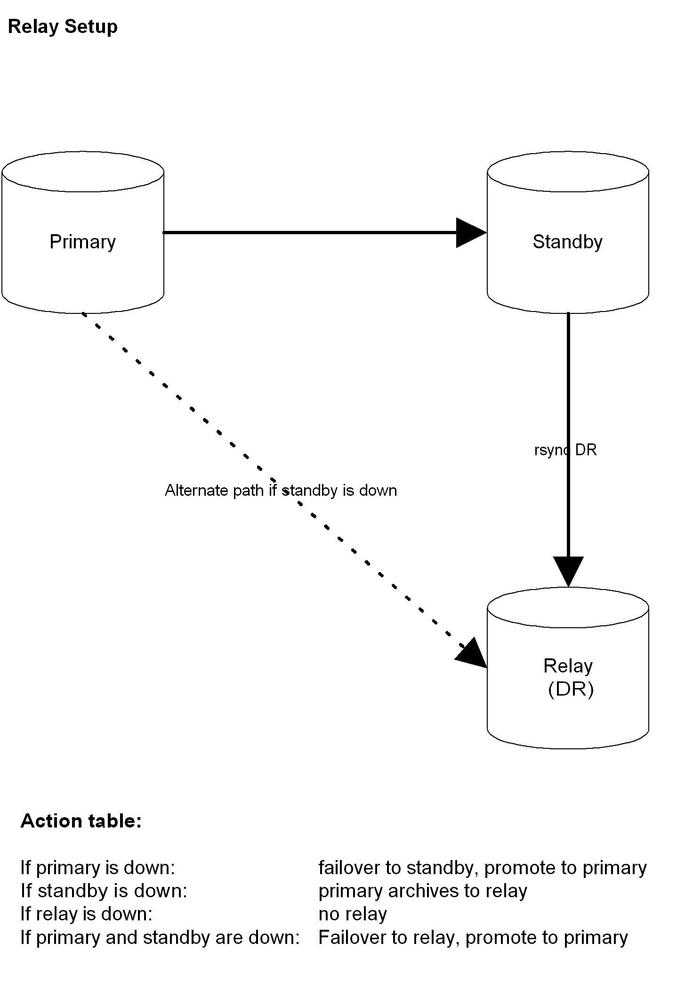

.. image:: images/2ndQuadrant-logo.png

=========================================
Replica PostgreSQL Warm-Standby con 2warm
=========================================

Introduzione
============

Il modo tradizionale di introdurre alla tecnologia che sta dietro al sistema
warm standby di PostgreSQL è la documentazione ufficiale. La versione di warm
standby distribuita con PostgreSQL 8.4 è la più completa:
http://www.postgresql.org/docs/8.4/static/backup.html

Alcuni termini comuni utilizzati in questa area, alcuni dei quali sono
specifici al software ``2warm`` sono:

* Write-ahead log (WAL): PostgreSQL scrive le informazioni in una serie di file **write-ahead log**, in segmenti di 16MB ciascuno, prima di applicare le corrispondenti modifiche al database stesso. Partendo da una identica coppia di database e applicando gli stessi file WAL, la coppia risultante sarà anch'essa identica - dal momento che i WAL contengono informazioni sui dati cambiati.
* Base backup: Un backup del database fatto in modo da includere tutto ciò che sia necessario per ripristinare la normalità delle operazioni in seguito a *crash*, considerando anche i file modificati durante il periodo di esecuzione del backup. Ciò richiede l'utilizzo dei comandi ``pg_start_backup`` e ``pg_stop_backup`` oltre a effettuare copie di backup sia dell'intero database che dei file di WAL archiviati durante il periodo compreso fra l'esecuzione dei due comandi.
* Point-in-time recovery (PITR): Disponendo di un **base backup** e di una serie di **file WAL**, è possibile decidere di ripristinare la situazione fino a un certo istante, applicando parzialmente le informazioni contenute nei file WAL. Ciò permette di utilizzare la funzionalità nota con il nome di **point in time recovery** (PITR).
* Trasferimento dei log basato su file: Trasferendo ed archiviando i nuovi file WAL su un altro server e disponendo di un *base backup*, il nuovo server può essere tenuto sincronizzato con l'originale. In inglese, il termine utilizzato è **file-based log shipping**.
* Standby: Un sistema avente un *base backup* completo e una serie di file di log trasferiti può essere un sistema **standby**, ovvero un server con esattamente gli stessi dati dell'originale. Un server standby è tenuto aggiornato sulla base del concludersi di nuove transazioni (o del passare del tempo) e del relativo trasferimento dei file WAL su di esso. Un server **warm standby** applica **in modo continuo** i nuovi file WAL non appena trasferiti.
* Fail-over: E' il procedimento che prevede il termine della modalità *recovery* per il server di standby e l'inizio delle attività come server principale, utilizzando un file di "trigger". In situazioni di *failover* intenzionali (conosciute anche con il termine *switch-over*), è possibile fermare prima il server primario, assicurandosi che tutti i dati siano stati trasferiti. In un caso reale di fallimento, ciò non sarà possibile e le transazioni più recenti con ``COMMIT`` (quelle non trasferite al server standby) non saranno disponibili sullo standby, neo-promosso a primario.
* Disaster Recovery Relay: E' possibile ritrasmettere (*relay*) i file che lo standby riceve ad un terzo sistema (o potenzialmente più di uno). Questi sistemi diventano possibili candidati in caso di disastro, nel caso sfortunato in cui sia il primario che lo standby vadano persi.

La storia delle funzionalità native per la replica di PostgreSQL
================================================================

8.1
---

PostgreSQL 8.1 ha introdotto nel database la funzionalità di Point-in-time
recovery (PITR).  La funzionalità permette di ricostruire un database
utilizzando un "base backup" del suo stato corrente, insieme a una serie di
file WAL (write-ahead log) che contengono tutte le modifiche occorse ai dati a
partire da quel momento. L'applicazione delle informazioni contenute nei file
di log (in gergo tecnico "replay") può richiedere anche un tempo maggiore a
quello originale. Il salvataggio dei file su un altro sistema ha permesso
l'implementazione di un sistema semplice di replica di un database su un nodo
in standby e di un'ottima soluzione per il *disaster recovery*.

8.2
---

PostgreSQL 8.2 ha migliorato la situazione introducendo il concetto di **warm
standby**. Piuttosto che aspettare l'attivazione del database, i server in
standby sono in continua attesa di nuovi file WAL e li applicano non appena li
ricevono. In gergo tecnico, i server sono in **continuous recovery**. Questa
funzionalità permette una replica quasi in tempo reale, riducendo drasticamente
i tempo di ripristino in caso di fallimento del server primario.  Tuttavia,
warm standby è molto lontano dall'essere pronto per una installazione di base
di PostgreSQL. Una delle parti fondamentali per permettere il funzionamento
ottimale di questo sistema è un programma in grado di recuperare i nuovi
segmenti WAL e applicarli sul server secondario. Un programma simile non è
fornito in PostgreSQL 8.2. 2ndQuadrant a quel tempo sviluppò *pg_standby*,
un'applicazione open-source in grado di eseguire questo compito.

8.3
---

PostgreSQL 8.3 viene distribuito con *pg_standby* facente parte dei moduli
opzionali (*contrib*). Inoltre, PostgreSQL aggiunge all'opzione di
configurazione *archive_command* l'utilissima funzione "%r" (per la pulizia dal
sistema dei file WAL già applicati). In precedenza, era necessario stimare il
numero di file necessari, con conseguente spreco di spazio derivante da
sovrastime per motivi di sicurezza.

8.4
---

8.4 aggiunge l'opzione *recovery_end_command*, solitamente utilizzata per
eliminare il file di trigger che determina il termine della fase di recovery.

9.0
---

La prossima release di PostgreSQL, la 9.0, integra la replica real-time in
streaming, piuttosto che la semplice copia di un WAL per volta, in un modo più
semplice da installare.  E la funzionalità *Hot Standby*, principalmente
sviluppata da 2ndQuadrant, permette l'esecuzione di query in lettura sui nodi
in standby.
Tuttavia, anche in PostgreSQL 9.0, è necessario eseguire attività di scripting
per gestire queste funzionalità. Attualmente, il pacchetto 2warm non supporta
la versione 9.0, ma è intenzione di 2ndQuadrant farlo prima dell'uscita
pubblica della release.

File di configurazione
======================

I percorsi dei file di configurazione sono tutti relativi alla directory
``2warm`` che tipicamente sarà installata allo stesso livello della *data
directory* di PostgreSQL (``$PGDATA/../2warm``); molti script dovranno essere
modificati e personalizzati qualora si intenda utilizzare una directory
diversa.

* ``global/recovery.conf``: file utilizzato da pg_standby e contenente il comando ``restore_command``. Non è utilizzato dal server primario e non dovrebbe mai cambiare da server a server.
* ``global/pg_hba.conf``: dovrebbe essere lo stesso per ogni server nel cluster.
* ``local/postgresql.conf``: questo file contiene la configurazione del nodo *locale*. Non dovrebbero esserci differenze di settaggi fra i diversi nodi del cluster. Tuttavia, questo sistema permette di personalizzare situazioni particolari in cui il nodo di disaster recovery (se presente) sia costretto a funzionare in configurazioni hardware più piccole della coppia *primary/standby*.
* ``local/environment.sh``: file di bash contenente variabili d'ambiente per la configurazione di PostgreSQL, qualora diverse dalle opzioni di default (in particolare data directory o porta TCP diverse).
* ``local/replication/othernode``: file di testo contenente il nome dell'host (o l'indirizzo IP) del nodo partner in una coppia *master/standby*.
* ``local/replication/drnode``: file di testo contenente il nome dell'host (o l'indirizzo IP) del nodo di relay per il disaster recovery sul quale vengono spediti i log. Può essere voto. E' utilizzato soltanto dal secondario, per ritrasmettere in modo asincrono (solitamente tramite cronjob) i dati sul nodo di disaster recovery.
* ``local/replication/archiving_active``: se presente il server procederà all'archiviazione dei file di log. Utilizzato solitamente dall'attuale nodo primario.

Comandi e script a disposizione
===============================

Gli script utilizzati seguono in linea generale uno dei percorsi illustrati in questo diagramma.

.. image:: images/internal.png

Gli script risiedono tutti all'interno della directory ``2warm/global/replication`` e possono essere raggruppati in 3 aree principali:

* setup iniziale;
* cambi di stato;
* utilità e script di background.

Setup iniziale
--------------

* ``archiveWALFile``: invocato dal server primario tramite l'opzione di configurazione ``archive_command``. Se ``archiving_active`` è impostato, salva ogni file WAL passato dal server.
* ``distrib2warm``: da eseguire sul server primario. Copia l'ambiente e gli script di 2warm sul server standby e, se presente, sul server di disaster recovery.
* ``configStandby``: da eseguire sul server standby. Copia i file ``postgresql.conf`` e ``recovery.conf`` necessari per predisporre uno standby e si assicura che il file di trigger non sia presente. Cancella il contenuto della cartella ``pg_xlog`` sul sistema. ATTENZIONE: questa operazione distruggerà il primario se accidentalmente eseguito su di esso invece che sullo standby e se il server primario è spento. Come misura precauzionale, lo script si interrompe se rileva un server primario in esecuzione.
* ``copyToStandby``: da eseguire sul server primario. Copia il database principale sul nodo standby, identificato dal file "othernode".
* ``copyToDR``: da eseguire sul server primario. Copia il database principale sul nodo di disaster recovery (ove presente).

Cambi di stato
--------------

* ``flushPrimary``: primo passo di un evento di **switchover**. Scarica (*flush*) tutta l'attività recente sul nodo standby. Le connessioni non privilegiate vengono prima disabilitate e il database viene poi interrotto di seguito.
* ``triggerStandby``: passo finale per le procedure di **switchover** e **failover**. Promuove lo standby (o il nodo di disaster recovery) a primario.

Utilità e script di background
------------------------------

* ``restoreWALFile``: invocato da ``restore_command`` sul server in standby, utilizza ``pg_standby`` per applicare un nuovo segmento WAL.
* ``rsyncDR``: da eseguire sul nodo standby tramite cron, una volta installato. Copia tutti i file di archivio WAL ricevuti dallo standby sul nodo di disaster recovery.
* ``configSetup``: libreria contenente le rubroutine comuni agli altri script shell. Se eseguito con il parametro debug, lo script si limiterà a visualizzare le informazioni di ambiente utilizzate dagli script. L'opzione è valida per tutti gli altri comandi di 2warm.

Diagrammi di architettura
=========================

Nel caso semplice con due nodi, le transizioni possibili sono abbastanza evidenti e semplici:

.. image:: images/two-node.png

In presenza di un terzo nodo di disaster recovery, vi sono molteplici altri possibili percorsi coinvolti:

Configurazione iniziale di 2warm
================================

Installazione di 2warm
----------------------

Estrarre il file tar contenente la distribuzione di 2warm all'interno della *home directory* dell'utente ``postgres`` sul sistema.

TODO

Copia del file postgresql.conf
------------------------------

Alla configurazione di PostgreSQL desiderata va aggiunta l'opzione ``archive_command`` in modo da informare il server di utilizzare 2warm per l'archiviazione dei file di WAL::

  archive_command = '../2warm/global/replication/archiveWALFile %p %f'

E' probabilmente opportuno aggiustare anche le opzioni ``archive_timeout`` e ``checkpoint_timeout``.

Gli script di 2warm si attendono che la configurazione di PostgreSQL (molto probabilmente identica su tutti i nodi) sia salvata all'interno della directory ``2warm/local`` e che questa sia utilizzata per sovrascrivere quella di sistema in certe situazioni.
Una volta effettuate le modifiche necessarie per aggiungere l'archiviazione alla copia di postgresql.conf dentro la directory $PGDATA, è necessario copiare il file nel seguente modo:

  cp $PGDATA/postgresql.conf 2warm/local/postgresql.conf 

Compile pg_standby
------------------

2warm ships with a customized version of the pg_standby utility it uses instead of the system one.  In order to compile and install it, you'll need the pg_config command working, which should show your configuration when you run it.

On RPM systems, pg_config is in the postgresql-devel package and can be installed like this::

  [user@db1 ~]$ sudo yum install postgresql-devel

You'll also need basic compile tools such as gcc, as well as a few standard development libraries::

  [user@db1 ~]$ sudo yum install gcc pam-devel openssl-devel readline-devel

Once pg_config works and you have all these packages, compile and install pg_standby by running its build script::

  [postgres``db1]$ cd 2warm/pg_standby/
  [postgres``db1]$ ./build 
  ~/2warm/global/replication ~/2warm/pg_standby
  ~/2warm/pg_standby
  gcc -O2 -g -pipe -Wall -Wp,-D_FORTIFY_SOURCE=2 -fexceptions -fstack-protector --param=ssp-buffer-size=4
  -m64 -mtune=generic -I/usr/include/et -Wall -Wmissing-prototypes -Wpointer-arith -Winline 
  -Wdeclaration-after-statement -Wendif-labels -fno-strict-aliasing -fwrapv pg_standby.o  -L/usr/lib64 
  -L/usr/lib64 -lpgport -lpam -lssl -lcrypto -lkrb5 -lz -lreadline -ltermcap -lcrypt -ldl -lm  
  -o pg_standby
  pg_standby installed to /var/lib/pgsql/2warm/global/replication

Setup trusted copy between postgres accounts
--------------------------------------------

WAL segments are copied between nodes using the rsync program running over ssh.  For this to work, the postgres accounts on each system need to be able to access files on their partner node without a password.  

First generate a ssh key, using an empty passphrase, and copy the resulting keys and a maching authorization file to a privledged user on the other system::

  [postgres``db1]$ ssh-keygen -t rsa
  Generating public/private rsa key pair.
  Enter file in which to save the key (/var/lib/pgsql/.ssh/id_rsa): 
  Enter passphrase (empty for no passphrase): 
  Enter same passphrase again: 
  Your identification has been saved in /var/lib/pgsql/.ssh/id_rsa.
  Your public key has been saved in /var/lib/pgsql/.ssh/id_rsa.pub.
  The key fingerprint is:
  aa:bb:cc:dd:ee:ff:aa:11:22:33:44:55:66:77:88:99 postgres``db1.domain.com
  [postgres``db1]$ cat ~/.ssh/id_rsa.pub >> ~/.ssh/authorized_keys
  [postgres``db1]$ chmod go-rwx ~/.ssh/*
  [postgres``db1]$ cd ~/.ssh
  [postgres``db1]$ scp id_rsa.pub id_rsa authorized_keys user``db2:

Login as that user on the other system, and install the files into the postgres user's account::

  [user@db2 ~]$ sudo chown postgres.postgres authorized_keys id_rsa.pub id_rsa
  [user@db2 ~]$ sudo mkdir -p ~postgres/.ssh
  [user@db2 ~]$ sudo chown postgres.postgres ~postgres/.ssh
  [user@db2 ~]$ sudo mv authorized_keys id_rsa.pub id_rsa ~postgres/.ssh
  [user@db2 ~]$ sudo chmod -R go-rwx ~postgres/.ssh

In situations where you have a direct login to both systems as the postgres account, the ssh-copy-id program may be easier to use than the above technique.

Now test that ssh in both directions works (you may have to accept some new known hosts in the process)::

  [user@db2 ~]$ sudo su - postgres
  [postgres``db2]$ ssh postgres``db1
  [postgres``db1]$ ssh postgres``db2

Setup 2warm scripts across all nodes
------------------------------------

Returning to the system with 2warm already installed on it, next you need to configure what nodes it expects to talk to.  These files are in the 2warm/local/replication directory.  Here's an example that sets up to talk to a partner but not disaster recovery node::

  [postgres``db1]$ cd 2warm/local/replication/
  [postgres``db1]$ echo "db2" > othernode 
  [postgres``db1]$ cp /dev/null drnode 

You can now use the distrib2warm script to install the software onto that partner, which will also test that the rsync link between the nodes (which is later used for WAL shiping) is working in that direction::

  [postgres``db1]$ cd 
  [postgres``db1]$ cd 2warm/global/replication/
  [postgres``db1]$ ./distrib2warm 
  Running rsync /var/lib/pgsql/2warm to db2
  building file list ... done
  2warm/
  2warm/docs/
  2warm/docs/2warm.doc
  2warm/global/
  2warm/global/pg_hba.conf
  2warm/global/recovery.conf
  2warm/global/replication/
  2warm/global/replication/archiveWALFile
  2warm/global/replication/configSetup
  2warm/global/replication/configStandby
  2warm/global/replication/copyToDR
  2warm/global/replication/copyToStandby
  2warm/global/replication/distrib2warm
  2warm/global/replication/flushPrimary
  2warm/global/replication/pg_standby
  2warm/global/replication/restoreWALFile
  2warm/global/replication/rsyncDR
  2warm/global/replication/triggerStandby
  2warm/local/
  2warm/local/postgresql.conf
  2warm/local/replication/
  2warm/local/replication/drnode
  2warm/local/replication/othernode
  2warm/pg_standby/
  2warm/pg_standby/.gitignore
  2warm/pg_standby/Makefile
  2warm/pg_standby/build
  2warm/pg_standby/pg_standby
  2warm/pg_standby/pg_standby.c
  2warm/pg_standby/pg_standby.o
  sent 464939 bytes  received 568 bytes  931014.00 bytes/sec
  total size is 462750  speedup is 0.99

Note that this will copy the directory “2warm” over, using the symlink if you created one earlier.  But the result on the standby will not have that structure—it will be converted to a standard directory with that name, losing the version information in the process.  You may want to manually adjust the nodes to match better in this regard by renaming the new copy with its version number and then creating a symlink as before.  You may also need to create the symlink from $PGDATA/../2warm to point to this install, if you've relocated $PGDATA.

Next you need to login to this new copy on the standby and change its othernode to point back to the primary::

  [postgres``db1]$ ssh postgres``db2
  [postgres``db2]$ cd 2warm/local/replication/
  [postgres``db2]$ echo "db1" > othernode 

Make sure “2warm/global/replication/pg_standby -V” works on the standby as well::

  [postgres``db2]$ cd ../../pg_standby/
  [postgres``db2]$ ./pg_standby -V
  pg_standby (PostgreSQL) 8.2.15 enhanced by 2ndQuadrant r1.0

You may want to install the same development packages required on the primary and confirm you can rebuild pg_standby on the standby system, too, to keep the systems better matching one another.

PGDATA relative install
-----------------------

2ware expects to live at $PGDATA/.. which will be the case if you install on a RPM-based system and extracting to the postgres user account.  If you relocated PGDATA, you will need an additional symlink to account for that as well.
Let's assume that your actual database is installed into /data/8.2.  You could link 2warm into the correct place like this::

  [user@db1 ~]$ source /etc/sysconfig/pgsql/postgresql 
  [user@db1 ~]$ echo $PGDATA
  /data/8.2
  [user@db1 ~]$ sudo ln -s ~postgres/2warm $PGDATA/..

The following should work as the postgres user on primary and standby nodes before you more forward::

  [postgres``db1]$ ls $PGDATA/../2warm
  docs  global  local  pg_standby

Install archive_command on master
---------------------------------

Now you want the archive_command to be working on the master node, even though it won't actually be shipping anywhere useful yet.  If your postgresql.conf file has large changes that included other modifications as part of setting that up, you should restart your primary server as normal.  If you only adjusted the archive_command, this you can get the server to recognize a configuration change on using a SIGHUP reload.  Here's an example that shows that in action, confirming the change was applied::

  [postgres``db1]$ psql -c "show archive_command"
   archive_command 
  -----------------
   
  (1 row)

  [postgres``db1]$ pg_ctl reload
  server signaled
  [postgres``db1]$ psql -c "show archive_command"
                   archive_command                  
  --------------------------------------------------
   ../2warm/global/replication/archiveWALFile %p %f
  (1 row)

Your server log files will now start warning that logs are being discarded because archiving is not fully active yet, which is expected at this point.  The messages look like this::

  Archiving not active: ignoring pg_xlog/000000010000000C00000090. Would normally save to db2:/data/8.2/archive/000000010000000C00000090.
  2010-02-10 13:31:34 CST::``:[27885]:LOG:  archived transaction log file "000000010000000C00000090"

If instead you see the following::

  sh: ../2warm/global/replication/archiveWALFile: No such file or directory

That means that $PGDATA/../2warm is not setup correctly.

Configure standby for recovery
------------------------------

The standby in this pair has a very specific configuration needed before replication to it can begin, and the configStandby script creates that configuration.  Login to the standby and confirm there's no server already running there.  If you find a postgres process, or data already in $PGDATA, you'll need to stop the server and wipe all of that out::

  [postgres``db2]$ ps -eaf | grep postmaster
  postgres  5019     1  0 Jan28 ?        00:00:02 /usr/bin/postmaster -p 5432 -D /data/8.2/
  postgres  5152  5100  0 13:11 pts/1    00:00:00 grep postmaster
  [postgres``db2]$ kill 5019
  [postgres``db2]$ ps -eaf | grep postmaster
  postgres  5154  5100  0 13:11 pts/1    00:00:00 grep postmaster
  [postgres``db2]$ cd $PGDATA
  [postgres``db2]$ ls
  base  global  pg_clog  pg_hba.conf  pg_ident.conf  pg_log  pg_multixact  pg_subtrans  
  pg_tblspc  pg_twophase  PG_VERSION  pg_xlog  postgresql.conf  postmaster.opts
  [postgres``db2]$ rm -rf *

Note that if you had a symlink for pg_xlog, you need to make sure that's put back again, and that it's contents are cleared out as well because the above “rm -rf” will not follow into it.
For example, if your xlog drive for this version is /xlog/8.2, you might replace it like this::

  [postgres``db2]$ cd /xlog/8.2/
  [postgres``db2]$ rm -rf *
  [postgres``db2]$ cd $PGDATA
  [postgres``db2]$ ln -s /xlog/8.2 pg_xlog

configStandby will actually clean up the pg_xlog directory even if you don't in this case, but you do have to worry about the symlink creation.
Next run the configStandby utility::

  [postgres``db2]$ cd 
  [postgres``db2]$ cd 2warm/global/replication/
  [postgres``db2]$ ./configStandby 
  psql: could not connect to server: No such file or directory
    Is the server running locally and accepting
    connections on Unix domain socket "/tmp/.s.PGSQL.5432"?
  Standby system is ready, shipped archives will appear in /data/8.2//archive

The psql error message here is normal—that comes from the program confirming you're not trying to run this script on a server with a working database on it, which would cause data loss.  It only proceeds if that psql attempt fails.

Base backup onto secondary
--------------------------

Now return the primary system and launch copyToStandby to get a base backup put onto there::

  [postgres``db1]$ cd 2warm/global/replication/
  [postgres``db1]$ ./copyToStandby 
  Copying  /data/8.2  to  db2
  Wed Feb 10 13:39:20 CST 2010
   archiving_active written at C/99000000

   Starting online backup at WAL file 000000010000000C00000099

  building file list ... done
  ./
  PG_VERSION
  backup_label
  pg_hba.conf
  pg_ident.conf
  postmaster.opts
  postmaster.pid
  base/
  base/1/
  base/1/10737
  …
  pg_multixact/
  pg_multixact/members/
  pg_multixact/members/0000
  pg_multixact/offsets/
  pg_multixact/offsets/0000
  pg_subtrans/
  pg_subtrans/0005
  pg_tblspc/
  pg_twophase/

  sent 5125197730 bytes  received 42380 bytes  33389186.38 bytes/sec
  total size is 5124444648  speedup is 1.00

  real    2m32.828s
  user    2m6.776s
  sys     0m13.363s
   Stopping online backup at WAL file 000000010000000C00000099

Note that this enables the local/replication/archiving_active at the appropriate time.

Confirm new log file segments appear on standby
-----------------------------------------------

You should now have files being shipped to the standby, but not actually being processed by it yet.  Confirm that's the case by looking for the .backup file made by the above script on the standby::

  [postgres``db2]$ cd $PGDATA/archive
  [postgres``db2]$ ls -l *.backup

  -rw------- 1 postgres postgres 247 Feb 10 13:42 000000010000000C00000099.00000020.backup

As additional activity occurs on the primary, more files should appear in this area, even if you don't start the standby server yet.  Here's an example::

  [postgres``db2]$ ls -l
  total 16408
  -rw------- 1 postgres postgres 16777216 Feb 10 13:41 000000010000000C00000099
  -rw------- 1 postgres postgres      247 Feb 10 13:42 000000010000000C00000099.00000020.backup

You can pause for another file to transfer, or force an xlog swith using pg_switch_xlog().  Eventually you should see another segment arrive::

  [postgres``db2]$ ls -l
  total 32812
  -rw------- 1 postgres postgres 16777216 Feb 10 13:41 000000010000000C00000099
  -rw------- 1 postgres postgres      247 Feb 10 13:42 000000010000000C00000099.00000020.backup
  -rw------- 1 postgres postgres 16777216 Feb 10 13:46 000000010000000C0000009A

Monitoring and forcing archiving changes
-----------------------------------------

If you have made changes to the primary, and want to force them to the standby immediately rather than wait for the timeout, use the pg_switch_xlog call on the primary.  The following example shows how to check the file locations the server is currently using, force a switch to a new segment (which will then trigger archiving that new segment), and how the segments advance afterwards::

  postgres@db1 $ psql -c "SELECT pg_xlogfile_name((SELECT pg_current_xlog_insert_location())) AS current, \
  pg_xlogfile_name((SELECT pg_current_xlog_insert_location())) AS insert" 
           current          |          insert          
  --------------------------+-------------------------- 
   0000000100000000000000DE | 0000000100000000000000DE 
  (1 row) 

  postgres@db1 $ psql -c "checkpoint" 
  CHECKPOINT 
  postgres@db1 $ psql -c "SELECT pg_xlogfile_name((SELECT pg_switch_xlog())) AS switched_from"; 
        switched_from       
  -------------------------- 
   0000000100000000000000DE 
  (1 row) 

  postgres@db1 $ psql -c "SELECT pg_xlogfile_name((SELECT pg_current_xlog_insert_location())) AS current, \
  pg_xlogfile_name((SELECT pg_current_xlog_insert_location())) AS insert" 
           current          |          insert          
  --------------------------+-------------------------- 
   0000000100000000000000DF | 0000000100000000000000DF 
  (1 row) 

Note that if there hasn't been any activity on the primary since the last xlog switch, the pg_xlog_switch may not actually do anything.  The underlying changes does require at least one new transaction has appeared before it can advance to a new segment.

Start standby in recovery mode
------------------------------

In order to make the standby warm, so it applies new files as they show up, you start the server on the standby normally.  The existing of the recovery.conf file that configStandy installed for you will keep it in recovery mode::

  [postgres``db2]$ cat $PGDATA/recovery.conf
  restore_command = '../2warm/global/replication/restoreWALFile %f %p'
  [postgres``db2]$ pg_ctl start
  pg_ctl: another server might be running; trying to start server anyway
  server starting

The “another server might be running” message comes from the fact that our base backup  included the postmaster.pid file suggesting the copy was active.  This is a normal warning and can be ignored.

The standby will now consume new log files as they appear.  If you try to run queries against it, they will fail::

  postgres``d3 $ psql 
  psql: FATAL:  the database system is starting up 

Monitoring the standby logs
---------------------------

Information about the restore_command's activity is all written to the standard database log files.  You will see a few warning messages about invalid files during the initial recovery initialization::

  2010-02-10 13:50:15 CST::``:[5383]:LOG:  database system was interrupted at 2010-02-10 13:39:20 CST
  2010-02-10 13:50:15 CST::``:[5383]:LOG:  starting archive recovery
  2010-02-10 13:50:15 CST::``:[5383]:LOG:  restore_command = "../2warm/global/replication/restoreWALFile %f %p"
  pg_standby: invalid NEXTWALFILENAME
  Try "pg_standby --help" for more information.
  ERROR: pg_standby returned error 2
  pg_standby: invalid NEXTWALFILENAME
  Try "pg_standby --help" for more information.
  ERROR: pg_standby returned error 2

These are all normal.

Afterwards, you should begin seeing the archive log files after the backup was completed being processed.  The first thing you'll see checked is the last segment mentioned in the backup::

  2010-02-10 13:50:15 CST::``:[5383]:LOG:  restored log file "000000010000000C00000099" from archive
  2010-02-10 13:50:15 CST::``:[5383]:LOG:  checkpoint record is at C/99000020
  2010-02-10 13:50:15 CST::``:[5383]:LOG:  redo record is at C/99000020; undo record is at 0/0; shutdown FALSE
  2010-02-10 13:50:15 CST::``:[5383]:LOG:  next transaction ID: 0/333404; next OID: 48242134
  2010-02-10 13:50:15 CST::``:[5383]:LOG:  next MultiXactId: 1; next MultiXactOffset: 0
  2010-02-10 13:50:15 CST::``:[5383]:LOG:  automatic recovery in progress
  2010-02-10 13:50:15 CST::``:[5383]:LOG:  redo starts at C/99000070

And then regular log files will be processed with logged entries like this::

  Trigger file            : trigger
  Waiting for WAL file    : 000000010000000C0000009A
  WAL file path           : /data/8.2//archive/000000010000000C0000009A
  Restoring to            : pg_xlog/RECOVERYXLOG
  Sleep interval          : 30 seconds
  Max wait interval       : 0 forever
  Command for restore     : cp "/data/8.2//archive/000000010000000C0000009A" "pg_xlog/RECOVERYXLOG"
  Keep archive history    : 000000010000000C0000003A and later
  running restore         : OK
  2010-02-10 13:50:15 CST::``:[5383]:LOG:  restored log file "000000010000000C0000009A" from archive

Setup optional disaster recovery node and relay system
------------------------------------------------------

[Example to be written]

Changing Node States
====================

Failover: Trigger standby
-------------------------

If you want to bring the standby up, but the primary is unavailable or you do not want to interrupt it (perhaps as part of testing), you can do that using the triggerStandby script::

  [postgres``db2]$ ./triggerStandby 

  Server now triggered to start

Once recovery is complete and the server running, delete /data/8.2//trigger to reduce the chance of a future triggering accident.

Next, follow the advice given there to confirm the server came up properly, then delete the trigger file::

  [postgres``db2]$ psql -c "select 1"

   ?column? 

  ----------

          1

  (1 row)

  [postgres``db2]$ rm $PGDATA/trigger

Note that triggerStandby does take care of turning off the archiving_active feature on the standby, so it doesn't try and ship anything back to its original master accidentally—if, for example, you're just testing the standby.  In a true failover, you'll now need to reprovision the master as a standby in order to make it work properly.

If your intention is to run this standby standalone, you probably want to disable archiving on the master to disconnect the two (which is normally harmless, but wasteful and possibly confusing)::

  [postgres``db1]$ rm 2warm/local/replication/archiving_active 

Standby shutdown/restart
------------------------

If you want to stop a standby, perhaps for rebooting the standby node, but without triggering it to exit recovery, you should do that with the pg_ctl fast shutdown::

  postgres@db2 $ pg_ctl stop -m fast 
  waiting for server to shut down....done 
  server stopped

The default “smart” shutdown won't work because it treats the recovery process as something it should wait for.

To bring the system back up and return it to running the warm standby recovery loop, return to the instructions of the “Start standby (in recovery mode)” section, using pg_ctl start.

Switchover:  Flush primary + trigger standby
--------------------------------------------

To do a completely clean switchover from a primary you want to take down (perhaps for maintenance), you first execut the flushPrimary script to stop it in a way that prevents clients from accessing it, then synchronizes all data over to the secondary (and disaster recovery node if available).  Here is what a successful flushPrimary looks like::

  postgres@db1 $ ./flushPrimary 
  Saving primary log files to the standby 
  building file list ... done 
  postgresql-2010-02-15_011921.log 
  postgresql-2010-02-15_013011.log 

  sent 1942 bytes  received 70 bytes  1341.33 bytes/sec 
  total size is 28665  speedup is 14.25 
  Executing pre-flush checkpoint 
  CHECKPOINT 
  Waiting for flush database process to connect 
  Blocking new connections to the server (60 seconds, will report failure) 
  waiting for server to shut down............................................................... failed 
  pg_ctl: server does not shut down 
  Waiting for archiver flush to complete 
   pg_switch_xlog 
  ---------------- 
   0/EE000130 
  (1 row) 

  Server shutdown normally 
  Flushing archive WAL files to standby 
  skipping directory /var/lib/pgsql/data/pg_xlog/archive_status 

Once this is done, the standby can be triggered in the same way as the Failover case described above.

Testing of a new installation
=============================

Switchover
----------

* db1: flushPrimary
* db2:  triggerStandby

Switchback
----------

* db1: Clear $PGDATA; configureStandby
* db2: copyToStandby
* db1: pg_ctl start
* db2: flushPrimary
* db1: triggerStandby

Failover
--------

* db1: kill database server abruptly (pg_ctl stop -m immediate)
* db2:  triggerStandby

Disaster Recovery
-----------------

[Example to be written]
