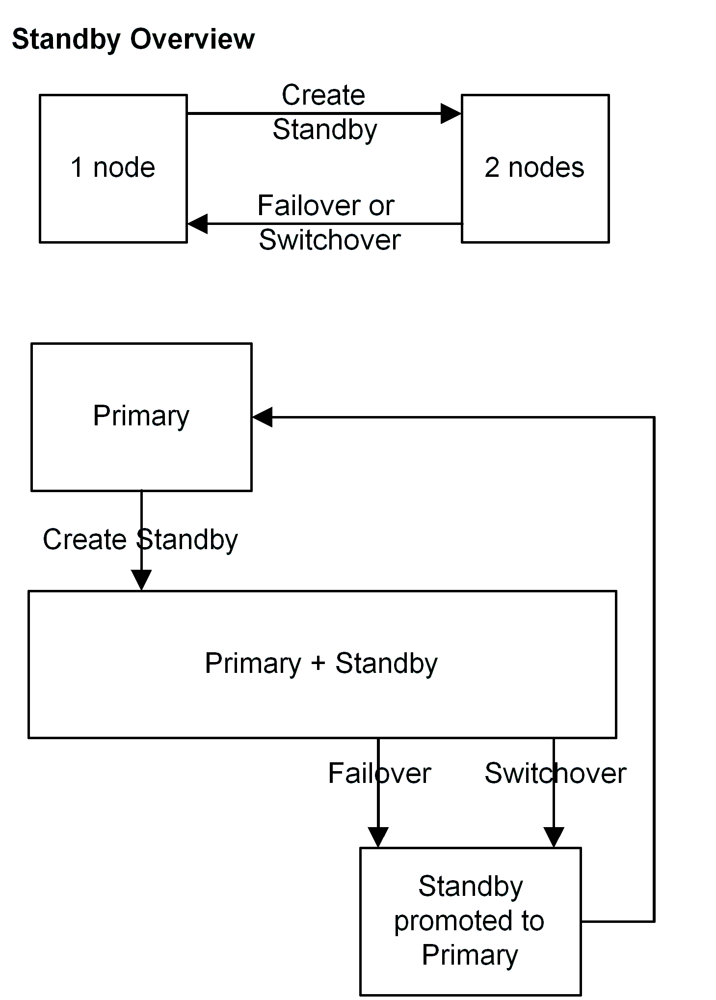

==============================================
PostgreSQL Warm-Standby Replication with 2warm
==============================================

Introduction
============

Terminology
-----------

The standard introduction to the technology behind the PostgreSQL warm standby system is the official documentation.  The version of warm standby that ships with 8.4 has the most complete such documentation:  http://www.postgresql.org/docs/8.4/static/backup.html

This is a good place to start even if you are targeting an earlier version, because the documentation has been updated to be more readable and complete.  You just need to note which features are not available in the version you're using, which is covered below.

Some common terms used in this area, some of which are specific to this 2warm package, are:

* Write-ahead log (WAL):  PostgreSQL writes information to a series of write-ahead log files, in segments 16MB in size, before making corresponding changes to the database itself.  If you start with an identical pair of databases, and apply the same WAL files to them, the resulting pair will also be identical—since the WAL contains all changed data.
* Base backup:  A backup made of the database in a way that includes everything needed for the copy to go through crash recovery and be intact, even if files were changed during the time the backup was being made.  This requires using the pg_start_backup and pg_stop_backup commands, as well as making backup copies of both the entire database and the WAL files archived during the period between when those commands executed.
* Point-in-time recovery (PITR):  If you have a base database and a series of WAL files, you can apply only some of them and then stop recovering information from those WAL files.  This allows the point in time recovery feature.  This even allows complicated recovery situations like alternate timelines, where a rebuilt database diverges from its original history—perhaps multiple times in search of the best place to recover to—before the server is started.
* File-based log shipping:  If you make a base backup of a server, and then “ship” all of the new WAL files it archives to another server, that new server can be kept in sync with the original.
* Standby:  A system with a complete  base backup and a stream of file-based logs shipped to it can be a standby:  a server with exactly the same data as the original.  A standby is kept up to date as enough new transactions appear (or time passes) and WAL files are shipped to it.  A warm standby continuously applies new WAL files as they appear.
* Fail-over:  Taking the standby out of recovery mode and turning it into an active server, using what's called a “trigger” file.  In intentional failover situations, you can stop the primary first and make sure all its data has been flushed.  In a true failure of the primary situation, this will not be possible, and some recent transactions (the ones not yet shipped to the standby) committed on the primary may not be available on the standby that's not promoted to being a primary.
* Disaster Recovery Relay:  It is also possible to “relay” the files the standby receives to a third system (or potentially even more, although this is not directly supported by the standard 2warm scripts).  Those systems then also become useful disaster recovery candidates if both primary and secondary systems are lost.

History of Built-in PostgreSQL Replication Features
===================================================

8.1
---

PostgreSQL 8.1 introduced Point-in-time recovery (PITR) to the database.  This allows rebuilding a database using a “base backup” of its current state, along with a series of write-ahead log (WAL) files that contain all of the changes to the data since then.  “Replay” of the information in those WAL files can take as long or even longer than the original data did to accumulate however.  By saving those files to another system, this allowed simple replication of a database to a standby node.
But while many clients can make changes to the database at once, there's only one client doing the replay recovery.  Since that recovery didn't start until there was a fail-over to the standby system that made it the new primary, a failover of a standby that had been up for hours could correspondingly take hours to finish—during which the database server is down.

8.2
---

PostgreSQL 8.2 improved this situation by introducing the concept of a warm standby.  Rather than wait until the database was being activated, warm standbys continuously poll for new incoming WAL segments, and immediately apply them as they appear.  That makes the replication closer to real-time, and vastly decreases the expected fail-over time in the case of a failure on the primary.

The warm standby is far from being ready to go after a basic PostgreSQL install though.  One of the key parts of making this system work well is having a program to fetch the new segments and apply them to the secondary.  No such program is provided with PostgreSQL 8.2.  2ndQuadrant developed a reference implementation named pg_standby that handles this particular task.

8.3
---

PostgreSQL 8.3 ships with pg_standby as one of its contrib modules you can optionally use.  It also adds the useful new feature “%r” feature to the archive_command allowing better pruning of old WAL files from the system.  In 8.2, you had to guess how many still needed, which inevitably resulted in wasted disk space from the overestimation required for safety.

8.4
---

8.4 adds the recovery_end_command option, typically used to clean up the trigger file when coming out of recovery.

9.0
---

The upcoming PostgreSQL 9.0 integrates real-time streaming replication, rather than just copying a full WAL file at a time, into an easier to setup form than was ever available before.  And the Hot Standby feature, primarily developed by 2ndQuadrant, allows executing queries against standby nodes.

There is still some scripting required in order to manage these new features in 9.0.  Currently, the 2warm package does not support 9.0, but the expectation is that it will be upgraded to do so before 9.0 is released.  This should result in a fairly smooth transition path if you are already using the 2warm package but eventually upgrade to a version with better replication features.

Configuration files
===================

These are all relative locations from the 2warm directory, which will typically be in $PGDATA/../2warm ; several scripts will need to be customized if this is not where the scripts are located at.

* global/recovery.conf:  restore_command file needed by pg_standby.  This is expected to be the same on every server in the cluster.  It is not used on the primary however.
* global/pg_hba.conf:  This is expected to be the same on every server in the cluster.
* local/postgresql.conf:  This particular node's postgresql.conf file.  There need not be any difference between the settings used on any particular node.  This setup does allow customizations for situations like when the disaster recovery node runs on a smaller hardware configuration than the primary/standby pair.
* local/replication/othernode:  Text file containing the hostname of the partner node in a master/standby pair.
* local/replication/drnode:  Text file containing the hostname of the disaster recovery relay node logs are shipped to.  Can be empty.  Only used on the secondary, to relay data over to the disaster recovery node.
* local/replication/archiving_active:  If this file exists, the server will archive WAL files.  Only used on the current primary.

Available Scripts and Commands
==============================

The scripts used generally follows one of the paths outlined on this internal diagram:

These scripts are all in the 2warm/global/replication directory.

Initial setup
-------------

* archiveWALFile:  Called by archive_command on primary.  If archiving_active is set, save any WAL files the server hands over.
* distrib2warm:  Runs on the primary.  Copies the 2warm script environment over to the standby and, if available the disaster recovery node.
* configStandby:  Copies postgresql.conf and recovery.conf needed to setup a standby and makes sure it's not triggered.  Erases all the pg_xlog files on the system.  WARNING:  This will destroy a primary if it's accidentally executed there, instead of on its intended target of a fresh standby, and if the primary server is down at the time.  The script will abort itself if it discovers there's an active database running as a safety feature.
* copyToStandby: Runs on the primary.  Copies the main database over its standby “othernode”
* copyToDR:   Runs on the primary.  Copies the main database over to a disaster recovery node.  Optional—only needed if there is a disaster recovery node.

State changes
-------------

* flushPrimary:  First step for Switchover event.  Flush out all recent activity to the standby.  Non-superuser connections should be disabled before this script is run, and the primary database server stopped afterwards.
* triggerStandby:  Final step for Switchover and Failover events.  Promotes a standby or disaster recovery node to a primary.

Utility and Background Scripts
------------------------------

* restoreWALFile:  Called by restore_command, uses pg_standby to apply a new WAL segment.
* rsyncDR:  Runs via cron on the standby once installed.  Copies all of the WAL archives the standby has received to the disaster recovery node.
* configSetup:  Subroutine library for rest of the commands.  If run with the parameter “debug” this script will, like all the other standalone scripts in this directory, just print the environment information the scripts here are working with and then exit.

Architecture Diagrams
=====================

In the simple two-node case, the transitions possible are fairly straightforward:

If a third disaster recovery node is added, there are several more possible paths involved:

.. image:: images/dr-node.png

Initial Configuration of 2warm
==============================

Install 2warm package
---------------------

Extract the distribution tar file into the home directory of the postgres user on the system.  In this and later examples, "user" is used as the name of another account on the system that has sudo rights,
which are not advisable to provide for the postgres account itself.

The extracted directory will include a version number.  You need to create a symlink from that to the name “2warm”.  This allows installing more than one version of the software and switching between them just with a symlink change::

  [user@db1 ~]$ ls -l
  -rw-r--r-- 1 user user  177460 Feb 10 12:03 2warm-2.0-4.tar.gz
  [user@db1 ~]$ sudo chown postgres.postgres 2warm-2.0-4.tar.gz 
  [user@db1 ~]$ sudo cp 2warm-2.0-4.tar.gz ~postgres/
  [user@db1 ~]$ sudo su - postgres
  [postgres@db1]$ tar xvf 2warm-2.0-4.tar.gz 
  2warm-2.0-4/
  2warm-2.0-4/docs/
  2warm-2.0-4/docs/2warm.doc
  2warm-2.0-4/global/
  2warm-2.0-4/global/pg_hba.conf
  2warm-2.0-4/global/recovery.conf
  2warm-2.0-4/global/replication/
  2warm-2.0-4/global/replication/archiveWALFile
  2warm-2.0-4/global/replication/configSetup
  2warm-2.0-4/global/replication/configStandby
  2warm-2.0-4/global/replication/copyToDR
  2warm-2.0-4/global/replication/copyToStandby
  2warm-2.0-4/global/replication/distrib2warm
  2warm-2.0-4/global/replication/flushPrimary
  2warm-2.0-4/global/replication/pg_standby
  2warm-2.0-4/global/replication/restoreWALFile
  2warm-2.0-4/global/replication/rsyncDR
  2warm-2.0-4/global/replication/triggerStandby
  2warm-2.0-4/local/
  2warm-2.0-4/local/postgresql.conf
  2warm-2.0-4/local/replication/
  2warm-2.0-4/local/replication/drnode
  2warm-2.0-4/local/replication/othernode
  2warm-2.0-4/pg_standby/
  2warm-2.0-4/pg_standby/.gitignore
  2warm-2.0-4/pg_standby/Makefile
  2warm-2.0-4/pg_standby/build
  2warm-2.0-4/pg_standby/pg_standby.c
  [postgres@db1]$ ln -s 2warm-2.0-4 2warm

Save master postgresql.conf
---------------------------

There is a sample postgresql.conf file distributed with 2warm in 2warm/local that shows how to correctly setup the archive_command needed for 2warm to work::

  archive_command = '../2warm/global/replication/archiveWALFile %p %f'

You may want to adjust archive_timeout and checkpoint_timeout as well.

The distribution scripts expect that the likely identical postgresql.conf on each system is saved into the 2warm/local directory, and that copy will be used to overwrite the system one in some situations.  Once you've made the appropriate changes to add archiving to your copy in $PGDATA, save it like this::

  [postgres@db1]$ cp $PGDATA/postgresql.conf 2warm/local/postgresql.conf 

Compile pg_standby
------------------

2warm ships with a customized version of the pg_standby utility it uses instead of the system one.  In order to compile and install it, you'll need the pg_config command working, which should show your configuration when you run it.

On RPM systems, pg_config is in the postgresql-devel package and can be installed like this::

  [user@db1 ~]$ sudo yum install postgresql-devel

You'll also need basic compile tools such as gcc, as well as a few standard development libraries::

  [user@db1 ~]$ sudo yum install gcc pam-devel openssl-devel readline-devel

Once pg_config works and you have all these packages, compile and install pg_standby by running its build script::

  [postgres@db1]$ cd 2warm/pg_standby/
  [postgres@db1]$ ./build 
  ~/2warm/global/replication ~/2warm/pg_standby
  ~/2warm/pg_standby
  gcc -O2 -g -pipe -Wall -Wp,-D_FORTIFY_SOURCE=2 -fexceptions -fstack-protector --param=ssp-buffer-size=4
  -m64 -mtune=generic -I/usr/include/et -Wall -Wmissing-prototypes -Wpointer-arith -Winline 
  -Wdeclaration-after-statement -Wendif-labels -fno-strict-aliasing -fwrapv pg_standby.o  -L/usr/lib64 
  -L/usr/lib64 -lpgport -lpam -lssl -lcrypto -lkrb5 -lz -lreadline -ltermcap -lcrypt -ldl -lm  
  -o pg_standby
  pg_standby installed to /var/lib/pgsql/2warm/global/replication

Setup trusted copy between postgres accounts
--------------------------------------------

WAL segments are copied between nodes using the rsync program running over ssh.  For this to work, the postgres accounts on each system need to be able to access files on their partner node without a password.  

First generate a ssh key, using an empty passphrase, and copy the resulting keys and a maching authorization file to a privledged user on the other system::

  [postgres@db1]$ ssh-keygen -t rsa
  Generating public/private rsa key pair.
  Enter file in which to save the key (/var/lib/pgsql/.ssh/id_rsa): 
  Enter passphrase (empty for no passphrase): 
  Enter same passphrase again: 
  Your identification has been saved in /var/lib/pgsql/.ssh/id_rsa.
  Your public key has been saved in /var/lib/pgsql/.ssh/id_rsa.pub.
  The key fingerprint is:
  aa:bb:cc:dd:ee:ff:aa:11:22:33:44:55:66:77:88:99 postgres@db1.domain.com
  [postgres@db1]$ cat ~/.ssh/id_rsa.pub >> ~/.ssh/authorized_keys
  [postgres@db1]$ chmod go-rwx ~/.ssh/*
  [postgres@db1]$ cd ~/.ssh
  [postgres@db1]$ scp id_rsa.pub id_rsa authorized_keys user@db2:

Login as that user on the other system, and install the files into the postgres user's account::

  [user@db2 ~]$ sudo chown postgres.postgres authorized_keys id_rsa.pub id_rsa
  [user@db2 ~]$ sudo mkdir -p ~postgres/.ssh
  [user@db2 ~]$ sudo chown postgres.postgres ~postgres/.ssh
  [user@db2 ~]$ sudo mv authorized_keys id_rsa.pub id_rsa ~postgres/.ssh
  [user@db2 ~]$ sudo chmod -R go-rwx ~postgres/.ssh

In situations where you have a direct login to both systems as the postgres account, the ssh-copy-id program may be easier to use than the above technique.

Now test that ssh in both directions works (you may have to accept some new known hosts in the process)::

  [user@db2 ~]$ sudo su - postgres
  [postgres@db2]$ ssh postgres@db1
  [postgres@db1]$ ssh postgres@db2

Setup 2warm scripts across all nodes
------------------------------------

Returning to the system with 2warm already installed on it, next you need to configure what nodes it expects to talk to.  These files are in the 2warm/local/replication directory.  Here's an example that sets up to talk to a partner but not disaster recovery node::

  [postgres@db1]$ cd 2warm/local/replication/
  [postgres@db1]$ echo "db2" > othernode 
  [postgres@db1]$ cp /dev/null drnode 

You can now use the distrib2warm script to install the software onto that partner, which will also test that the rsync link between the nodes (which is later used for WAL shiping) is working in that direction::

  [postgres@db1]$ cd 
  [postgres@db1]$ cd 2warm/global/replication/
  [postgres@db1]$ ./distrib2warm 
  Running rsync /var/lib/pgsql/2warm to db2
  building file list ... done
  2warm/
  2warm/docs/
  2warm/docs/2warm.doc
  2warm/global/
  2warm/global/pg_hba.conf
  2warm/global/recovery.conf
  2warm/global/replication/
  2warm/global/replication/archiveWALFile
  2warm/global/replication/configSetup
  2warm/global/replication/configStandby
  2warm/global/replication/copyToDR
  2warm/global/replication/copyToStandby
  2warm/global/replication/distrib2warm
  2warm/global/replication/flushPrimary
  2warm/global/replication/pg_standby
  2warm/global/replication/restoreWALFile
  2warm/global/replication/rsyncDR
  2warm/global/replication/triggerStandby
  2warm/local/
  2warm/local/postgresql.conf
  2warm/local/replication/
  2warm/local/replication/drnode
  2warm/local/replication/othernode
  2warm/pg_standby/
  2warm/pg_standby/.gitignore
  2warm/pg_standby/Makefile
  2warm/pg_standby/build
  2warm/pg_standby/pg_standby
  2warm/pg_standby/pg_standby.c
  2warm/pg_standby/pg_standby.o
  sent 464939 bytes  received 568 bytes  931014.00 bytes/sec
  total size is 462750  speedup is 0.99

Note that this will copy the directory “2warm” over, using the symlink if you created one earlier.  But the result on the standby will not have that structure—it will be converted to a standard directory with that name, losing the version information in the process.  You may want to manually adjust the nodes to match better in this regard by renaming the new copy with its version number and then creating a symlink as before.  You may also need to create the symlink from $PGDATA/../2warm to point to this install, if you've relocated $PGDATA.

Next you need to login to this new copy on the standby and change its othernode to point back to the primary::

  [postgres@db1]$ ssh postgres@db2
  [postgres@db2]$ cd 2warm/local/replication/
  [postgres@db2]$ echo "db1" > othernode 

Make sure “2warm/global/replication/pg_standby -V” works on the standby as well::

  [postgres@db2]$ cd ../../pg_standby/
  [postgres@db2]$ ./pg_standby -V
  pg_standby (PostgreSQL) 8.2.15 enhanced by 2ndQuadrant r1.0

You may want to install the same development packages required on the primary and confirm you can rebuild pg_standby on the standby system, too, to keep the systems better matching one another.

PGDATA relative install
-----------------------

2ware expects to live at $PGDATA/.. which will be the case if you install on a RPM-based system and extracting to the postgres user account.  If you relocated PGDATA, you will need an additional symlink to account for that as well.
Let's assume that your actual database is installed into /data/8.2.  You could link 2warm into the correct place like this::

  [user@db1 ~]$ source /etc/sysconfig/pgsql/postgresql 
  [user@db1 ~]$ echo $PGDATA
  /data/8.2
  [user@db1 ~]$ sudo ln -s ~postgres/2warm $PGDATA/..

The following should work as the postgres user on primary and standby nodes before you more forward::

  [postgres@db1]$ ls $PGDATA/../2warm
  docs  global  local  pg_standby

Install archive_command on master
---------------------------------

Now you want the archive_command to be working on the master node, even though it won't actually be shipping anywhere useful yet.  If your postgresql.conf file has large changes that included other modifications as part of setting that up, you should restart your primary server as normal.  If you only adjusted the archive_command, this you can get the server to recognize a configuration change on using a SIGHUP reload.  Here's an example that shows that in action, confirming the change was applied::

  [postgres@db1]$ psql -c "show archive_command"
   archive_command 
  -----------------
   
  (1 row)

  [postgres@db1]$ pg_ctl reload
  server signaled
  [postgres@db1]$ psql -c "show archive_command"
                   archive_command                  
  --------------------------------------------------
   ../2warm/global/replication/archiveWALFile %p %f
  (1 row)

Your server log files will now start warning that logs are being discarded because archiving is not fully active yet, which is expected at this point.  The messages look like this::

  Archiving not active: ignoring pg_xlog/000000010000000C00000090. Would normally save to db2:/data/8.2/archive/000000010000000C00000090.
  2010-02-10 13:31:34 CST::@:[27885]:LOG:  archived transaction log file "000000010000000C00000090"

If instead you see the following::

  sh: ../2warm/global/replication/archiveWALFile: No such file or directory

That means that $PGDATA/../2warm is not setup correctly.

Configure standby for recovery
------------------------------

The standby in this pair has a very specific configuration needed before replication to it can begin, and the configStandby script creates that configuration.  Login to the standby and confirm there's no server already running there.  If you find a postgres process, or data already in $PGDATA, you'll need to stop the server and wipe all of that out::

  [postgres@db2]$ ps -eaf | grep postmaster
  postgres  5019     1  0 Jan28 ?        00:00:02 /usr/bin/postmaster -p 5432 -D /data/8.2/
  postgres  5152  5100  0 13:11 pts/1    00:00:00 grep postmaster
  [postgres@db2]$ kill 5019
  [postgres@db2]$ ps -eaf | grep postmaster
  postgres  5154  5100  0 13:11 pts/1    00:00:00 grep postmaster
  [postgres@db2]$ cd $PGDATA
  [postgres@db2]$ ls
  base  global  pg_clog  pg_hba.conf  pg_ident.conf  pg_log  pg_multixact  pg_subtrans  
  pg_tblspc  pg_twophase  PG_VERSION  pg_xlog  postgresql.conf  postmaster.opts
  [postgres@db2]$ rm -rf *

Note that if you had a symlink for pg_xlog, you need to make sure that's put back again, and that it's contents are cleared out as well because the above “rm -rf” will not follow into it.
For example, if your xlog drive for this version is /xlog/8.2, you might replace it like this::

  [postgres@db2]$ cd /xlog/8.2/
  [postgres@db2]$ rm -rf *
  [postgres@db2]$ cd $PGDATA
  [postgres@db2]$ ln -s /xlog/8.2 pg_xlog

configStandby will actually clean up the pg_xlog directory even if you don't in this case, but you do have to worry about the symlink creation.
Next run the configStandby utility::

  [postgres@db2]$ cd 
  [postgres@db2]$ cd 2warm/global/replication/
  [postgres@db2]$ ./configStandby 
  psql: could not connect to server: No such file or directory
    Is the server running locally and accepting
    connections on Unix domain socket "/tmp/.s.PGSQL.5432"?
  Standby system is ready, shipped archives will appear in /data/8.2//archive

The psql error message here is normal—that comes from the program confirming you're not trying to run this script on a server with a working database on it, which would cause data loss.  It only proceeds if that psql attempt fails.

Base backup onto secondary
--------------------------

Now return the primary system and launch copyToStandby to get a base backup put onto there::

  [postgres@db1]$ cd 2warm/global/replication/
  [postgres@db1]$ ./copyToStandby 
  Copying  /data/8.2  to  db2
  Wed Feb 10 13:39:20 CST 2010
   archiving_active written at C/99000000

   Starting online backup at WAL file 000000010000000C00000099

  building file list ... done
  ./
  PG_VERSION
  backup_label
  pg_hba.conf
  pg_ident.conf
  postmaster.opts
  postmaster.pid
  base/
  base/1/
  base/1/10737
  …
  pg_multixact/
  pg_multixact/members/
  pg_multixact/members/0000
  pg_multixact/offsets/
  pg_multixact/offsets/0000
  pg_subtrans/
  pg_subtrans/0005
  pg_tblspc/
  pg_twophase/

  sent 5125197730 bytes  received 42380 bytes  33389186.38 bytes/sec
  total size is 5124444648  speedup is 1.00

  real    2m32.828s
  user    2m6.776s
  sys     0m13.363s
   Stopping online backup at WAL file 000000010000000C00000099

Note that this enables the local/replication/archiving_active at the appropriate time.

Confirm new log file segments appear on standby
-----------------------------------------------

You should now have files being shipped to the standby, but not actually being processed by it yet.  Confirm that's the case by looking for the .backup file made by the above script on the standby::

  [postgres@db2]$ cd $PGDATA/archive
  [postgres@db2]$ ls -l *.backup

  -rw------- 1 postgres postgres 247 Feb 10 13:42 000000010000000C00000099.00000020.backup

As additional activity occurs on the primary, more files should appear in this area, even if you don't start the standby server yet.  Here's an example::

  [postgres@db2]$ ls -l
  total 16408
  -rw------- 1 postgres postgres 16777216 Feb 10 13:41 000000010000000C00000099
  -rw------- 1 postgres postgres      247 Feb 10 13:42 000000010000000C00000099.00000020.backup

You can pause for another file to transfer, or force an xlog swith using pg_switch_xlog().  Eventually you should see another segment arrive::

  [postgres@db2]$ ls -l
  total 32812
  -rw------- 1 postgres postgres 16777216 Feb 10 13:41 000000010000000C00000099
  -rw------- 1 postgres postgres      247 Feb 10 13:42 000000010000000C00000099.00000020.backup
  -rw------- 1 postgres postgres 16777216 Feb 10 13:46 000000010000000C0000009A

Monitoring and forcing archiving changes
-----------------------------------------

If you have made changes to the primary, and want to force them to the standby immediately rather than wait for the timeout, use the pg_switch_xlog call on the primary.  The following example shows how to check the file locations the server is currently using, force a switch to a new segment (which will then trigger archiving that new segment), and how the segments advance afterwards::

  postgres@db1 $ psql -c "SELECT pg_xlogfile_name((SELECT pg_current_xlog_insert_location())) AS current, \
  pg_xlogfile_name((SELECT pg_current_xlog_insert_location())) AS insert" 
           current          |          insert          
  --------------------------+-------------------------- 
   0000000100000000000000DE | 0000000100000000000000DE 
  (1 row) 

  postgres@db1 $ psql -c "checkpoint" 
  CHECKPOINT 
  postgres@db1 $ psql -c "SELECT pg_xlogfile_name((SELECT pg_switch_xlog())) AS switched_from"; 
        switched_from       
  -------------------------- 
   0000000100000000000000DE 
  (1 row) 

  postgres@db1 $ psql -c "SELECT pg_xlogfile_name((SELECT pg_current_xlog_insert_location())) AS current, \
  pg_xlogfile_name((SELECT pg_current_xlog_insert_location())) AS insert" 
           current          |          insert          
  --------------------------+-------------------------- 
   0000000100000000000000DF | 0000000100000000000000DF 
  (1 row) 

Note that if there hasn't been any activity on the primary since the last xlog switch, the pg_xlog_switch may not actually do anything.  The underlying changes does require at least one new transaction has appeared before it can advance to a new segment.

Start standby in recovery mode
------------------------------

In order to make the standby warm, so it applies new files as they show up, you start the server on the standby normally.  The existing of the recovery.conf file that configStandy installed for you will keep it in recovery mode::

  [postgres@db2]$ cat $PGDATA/recovery.conf
  restore_command = '../2warm/global/replication/restoreWALFile %f %p'
  [postgres@db2]$ pg_ctl start
  pg_ctl: another server might be running; trying to start server anyway
  server starting

The “another server might be running” message comes from the fact that our base backup  included the postmaster.pid file suggesting the copy was active.  This is a normal warning and can be ignored.

The standby will now consume new log files as they appear.  If you try to run queries against it, they will fail::

  postgres@d3 $ psql 
  psql: FATAL:  the database system is starting up 

Monitoring the standby logs
---------------------------

Information about the restore_command's activity is all written to the standard database log files.  You will see a few warning messages about invalid files during the initial recovery initialization::

  2010-02-10 13:50:15 CST::@:[5383]:LOG:  database system was interrupted at 2010-02-10 13:39:20 CST
  2010-02-10 13:50:15 CST::@:[5383]:LOG:  starting archive recovery
  2010-02-10 13:50:15 CST::@:[5383]:LOG:  restore_command = "../2warm/global/replication/restoreWALFile %f %p"
  pg_standby: invalid NEXTWALFILENAME
  Try "pg_standby --help" for more information.
  ERROR: pg_standby returned error 2
  pg_standby: invalid NEXTWALFILENAME
  Try "pg_standby --help" for more information.
  ERROR: pg_standby returned error 2

These are all normal.

Afterwards, you should begin seeing the archive log files after the backup was completed being processed.  The first thing you'll see checked is the last segment mentioned in the backup::

  2010-02-10 13:50:15 CST::@:[5383]:LOG:  restored log file "000000010000000C00000099" from archive
  2010-02-10 13:50:15 CST::@:[5383]:LOG:  checkpoint record is at C/99000020
  2010-02-10 13:50:15 CST::@:[5383]:LOG:  redo record is at C/99000020; undo record is at 0/0; shutdown FALSE
  2010-02-10 13:50:15 CST::@:[5383]:LOG:  next transaction ID: 0/333404; next OID: 48242134
  2010-02-10 13:50:15 CST::@:[5383]:LOG:  next MultiXactId: 1; next MultiXactOffset: 0
  2010-02-10 13:50:15 CST::@:[5383]:LOG:  automatic recovery in progress
  2010-02-10 13:50:15 CST::@:[5383]:LOG:  redo starts at C/99000070

And then regular log files will be processed with logged entries like this::

  Trigger file            : trigger
  Waiting for WAL file    : 000000010000000C0000009A
  WAL file path           : /data/8.2//archive/000000010000000C0000009A
  Restoring to            : pg_xlog/RECOVERYXLOG
  Sleep interval          : 30 seconds
  Max wait interval       : 0 forever
  Command for restore     : cp "/data/8.2//archive/000000010000000C0000009A" "pg_xlog/RECOVERYXLOG"
  Keep archive history    : 000000010000000C0000003A and later
  running restore         : OK
  2010-02-10 13:50:15 CST::@:[5383]:LOG:  restored log file "000000010000000C0000009A" from archive

Setup optional disaster recovery node and relay system
------------------------------------------------------

[Example to be written]

Changing Node States
====================

Failover: Trigger standby
-------------------------

If you want to bring the standby up, but the primary is unavailable or you do not want to interrupt it (perhaps as part of testing), you can do that using the triggerStandby script::

  [postgres@db2]$ ./triggerStandby 

  Server now triggered to start

Once recovery is complete and the server running, delete /data/8.2//trigger to reduce the chance of a future triggering accident.

Next, follow the advice given there to confirm the server came up properly, then delete the trigger file::

  [postgres@db2]$ psql -c "select 1"

   ?column? 

  ----------

          1

  (1 row)

  [postgres@db2]$ rm $PGDATA/trigger

Note that triggerStandby does take care of turning off the archiving_active feature on the standby, so it doesn't try and ship anything back to its original master accidentally—if, for example, you're just testing the standby.  In a true failover, you'll now need to reprovision the master as a standby in order to make it work properly.

If your intention is to run this standby standalone, you probably want to disable archiving on the master to disconnect the two (which is normally harmless, but wasteful and possibly confusing)::

  [postgres@db1]$ rm 2warm/local/replication/archiving_active 

Standby shutdown/restart
------------------------

If you want to stop a standby, perhaps for rebooting the standby node, but without triggering it to exit recovery, you should do that with the pg_ctl fast shutdown::

  postgres@db2 $ pg_ctl stop -m fast 
  waiting for server to shut down....done 
  server stopped

The default “smart” shutdown won't work because it treats the recovery process as something it should wait for.

To bring the system back up and return it to running the warm standby recovery loop, return to the instructions of the “Start standby (in recovery mode)” section, using pg_ctl start.

Switchover:  Flush primary + trigger standby
--------------------------------------------

To do a completely clean switchover from a primary you want to take down (perhaps for maintenance), you first execut the flushPrimary script to stop it in a way that prevents clients from accessing it, then synchronizes all data over to the secondary (and disaster recovery node if available).  Here is what a successful flushPrimary looks like::

  postgres@db1 $ ./flushPrimary 
  Saving primary log files to the standby 
  building file list ... done 
  postgresql-2010-02-15_011921.log 
  postgresql-2010-02-15_013011.log 

  sent 1942 bytes  received 70 bytes  1341.33 bytes/sec 
  total size is 28665  speedup is 14.25 
  Executing pre-flush checkpoint 
  CHECKPOINT 
  Waiting for flush database process to connect 
  Blocking new connections to the server (60 seconds, will report failure) 
  waiting for server to shut down............................................................... failed 
  pg_ctl: server does not shut down 
  Waiting for archiver flush to complete 
   pg_switch_xlog 
  ---------------- 
   0/EE000130 
  (1 row) 

  Server shutdown normally 
  Flushing archive WAL files to standby 
  skipping directory /var/lib/pgsql/data/pg_xlog/archive_status 

Once this is done, the standby can be triggered in the same way as the Failover case described above.

Testing of a new installation
=============================

Switchover
----------

* db1: flushPrimary
* db2:  triggerStandby

Switchback
----------

* db1: Clear $PGDATA; configureStandby
* db2: copyToStandby
* db1: pg_ctl start
* db2: flushPrimary
* db1: triggerStandby

Failover
--------

* db1: kill database server abruptly (pg_ctl stop -m immediate)
* db2:  triggerStandby

Disaster Recovery
-----------------

[Example to be written]
